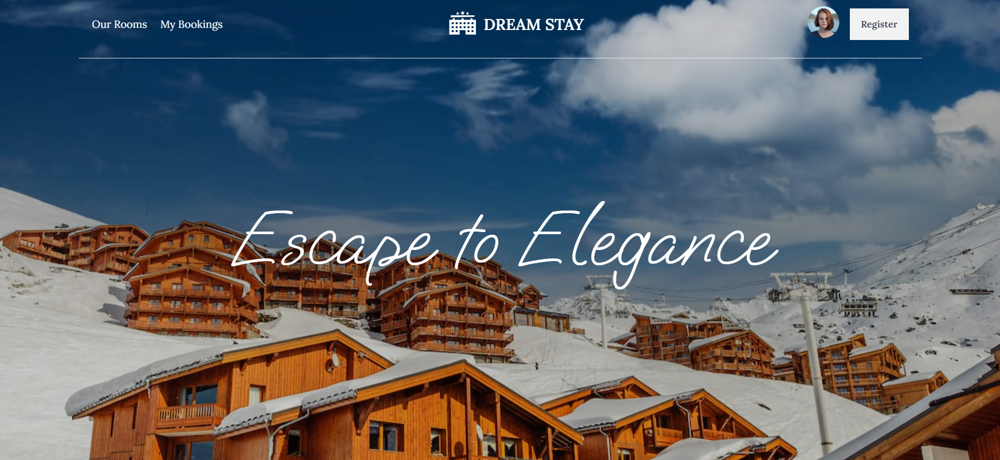

# Dream Stay - A Hotel Room Booking Website

_UI Design done by\_ {Myself}_

### Live Site : [Website Link](https://dream-stay-indev.web.app/)

### Server Site Repo : [Server Site Repository](https://github.com/Porgramming-Hero-web-course/b9a11-server-side-dev-ahad-ali)

#### Users To Check Out Website Features :

USER 1

- **Email** : user@user.com
- **Password** : User123

# Technology Used :

1. React
2. Tailwind Css
3. React Router
4. JavaScript
5. Axios
6. Firebase
7. Daisy UI
8. React Hook Form
9. Swiper Js
10. Moment Js
11. React Scroll Parallax
12. React Icons
13. React Tooltip
14. React Leaflet
15. React Tostify
16. Vite

# About The Project :

## Overview :

After Login a user book a room and post a review about the room on the website. The website is responsive for all devices including Desktop, Mobile, Tablet.

**This Website Contains** :

- home page
- Our Room Page
- Login page
- Registrations page
- My Room page
- Room Details page
- A Booking page
- 404 Error page

## Features :

- User can book room for and needed date through the website.
- Booking date can be updated through the My bookings page to the users linking
- A user can post a review and give a rating to each he books.
- Users can cancel a booking 1 day before the booked date.
- A sort system is also here so user can sort the rooms according the price range .
- Can log in using google account via the login page.
- Can create a new account through the registration page if needed.

## AboutThe Website

#### Home Page :

- A Navbar with all the necessary routes to navigate around the website.
- A beautiful Parallax banner
- A section to highlight the location of the Hotel.
- Exhibition section that displays some beautiful rooms in a card showing some key details.
- A News letter to sign up and get info about hotel and offers.
- A reviews section showing all the recent reviews clients have posted.
- A informative footer showing some showing some social contacts.

#### Our Room Page :

- this page contains all the room listed on the website and displays it in a small card format . But user can click the view details button to see all information.
- A sort system is also here so user can sort the rooms according the price range .

#### Login Page :

- User can login by email and password or by using any one of the social accounts listed her Google.
- User Login is necessary to view a lot of information on website and to use some features as well
- Firebase technology is used here to authenticate a use.

#### Registration Page :

- User can create a new account by filling up an form simple form.
- Firebase authentication is used here to create a user.

#### Booking Page :

- After login a user can access this route.
- User can select a date and book a room to his liking.

### My Booking Page :

- This page contains all the Rooms booked by the current logged in user.
- A use can post review, update date or cancel the booking from here. The changes will be saved on the database.
- A sort system is also here so user can sort the rooms according their price range .

### View Details page :

- A logged in use can see all the details of the chosen room on this page.

 

**Thank You For The Visit.**
